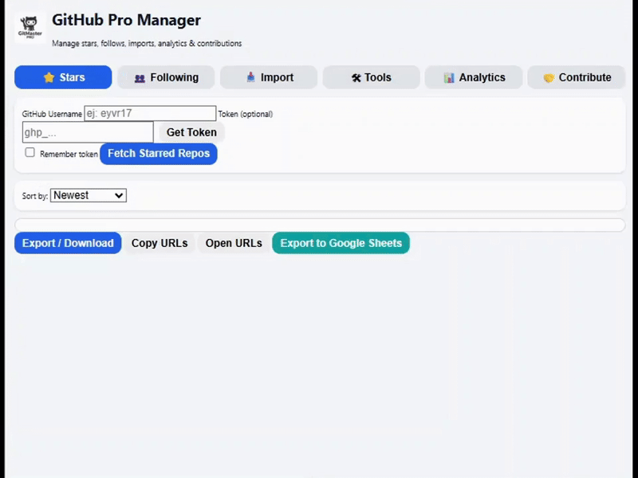

# ⭐ Git Master Pro

Git Master Pro is a Chrome extension for GitHub users.  
It helps you manage stars, follows, contributions, and see some stats with a simple interface.

<p align="center">
    
</p>

---

## Features

- Get starred repos from any user  
- Star/unstar a bunch of repos and follow/unfollow users easily  
- Compare who you follow and find new repos to contribute  
- Import/export to `.txt` or Google Sheets  
- Modern interface with an optional mode that doesn't save stuff  

---

## Demo

<p align="center">
    
</p>

---

## Installation

1. Clone the repo:

     ```bash
     git clone https://github.com/eyvr17/gitmasterpro.git
     cd gitmasterpro
     ```

2. Load it in Chrome:

     - Go to `chrome://extensions/`
     - Turn on developer mode
     - Click "Load unpacked"
     - Pick the project folder

---

## How to use

- Click the extension icon in the toolbar.
- Use the menu to get repos, star/unstar a lot at once, and export stuff.
- Optional: Sign in with Google to use Sheets.

---

## Example output

| Repository       | Stars  | Forks  | Language    |
|------------------|--------|--------|-------------|
| awesome-python   | 12000  | 2000   | Python      |
| react            | 200000 | 40000  | JavaScript  |

---

## File structure

```
starhub-manager/
├── files/
├── icons/
├── popup.html
├── popup.js
├── background.js
├── manifest.json
├── README.md
├── LICENSE
```

---

## Author

**@eyvr17**  
Contact: eyvr17@proton.me
